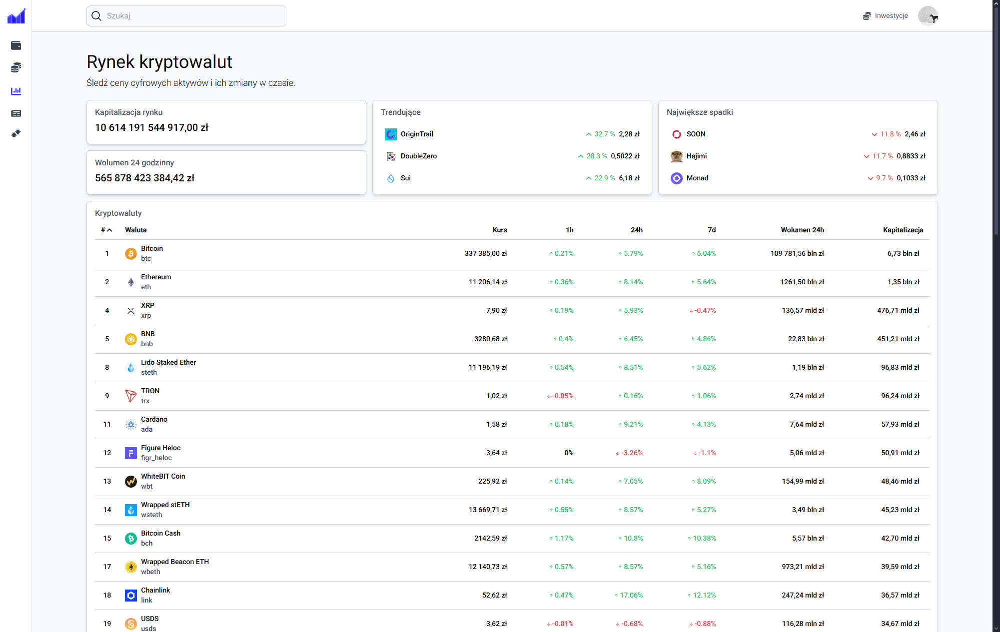
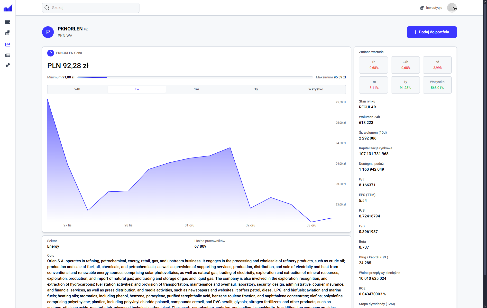
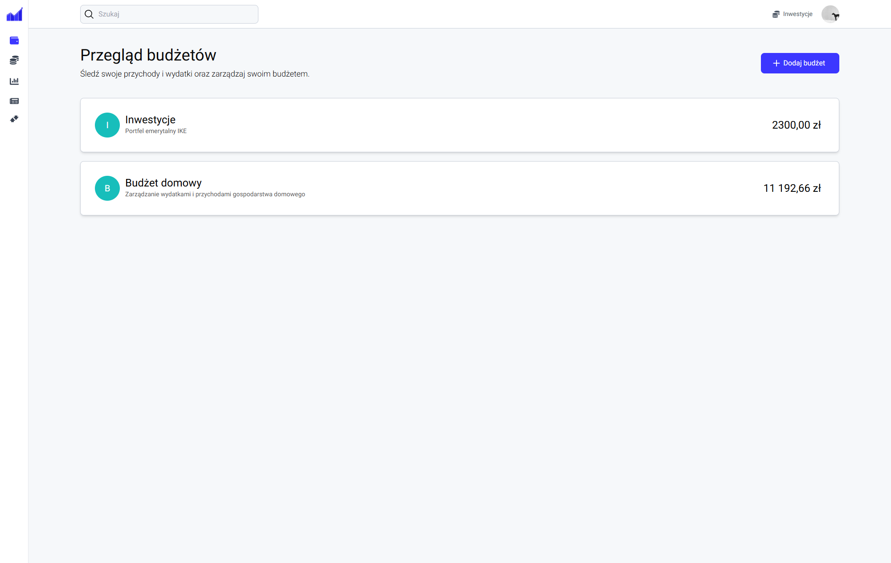
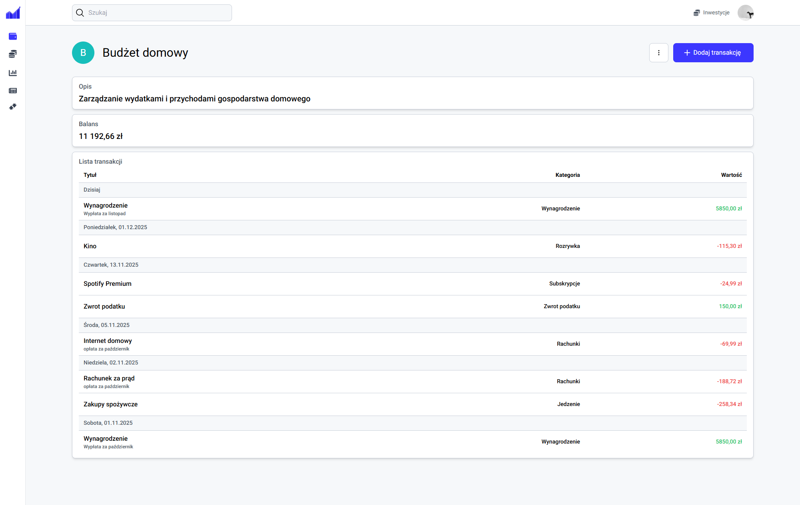
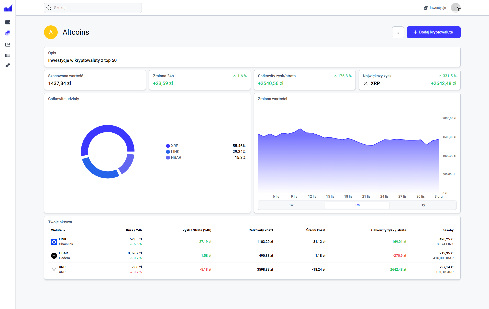
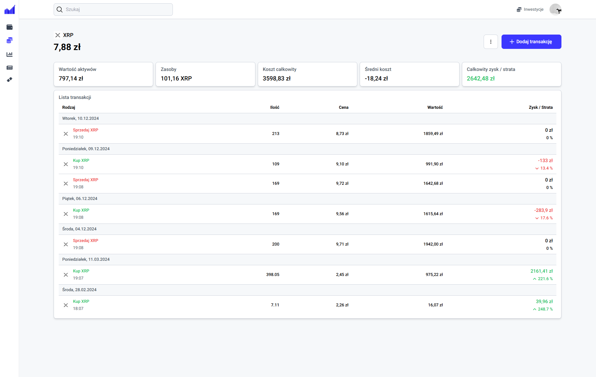
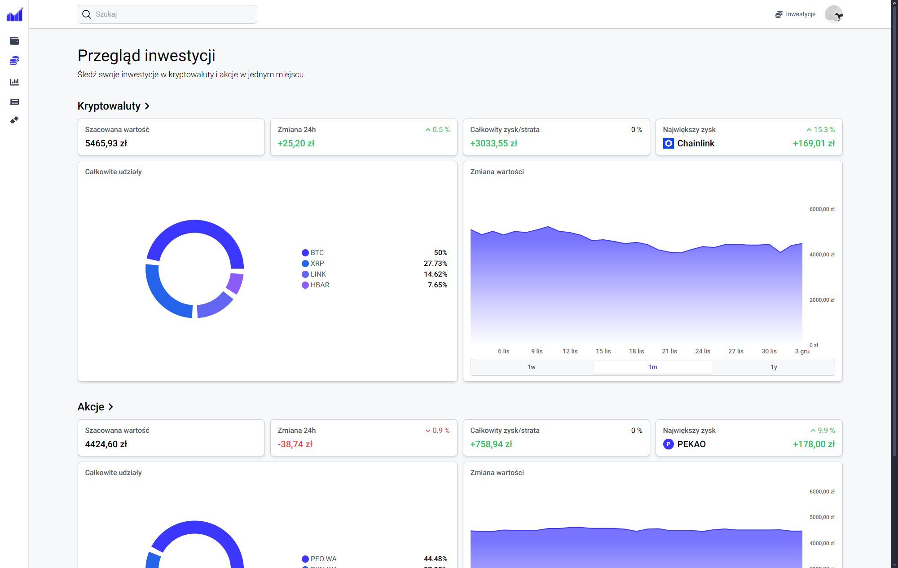
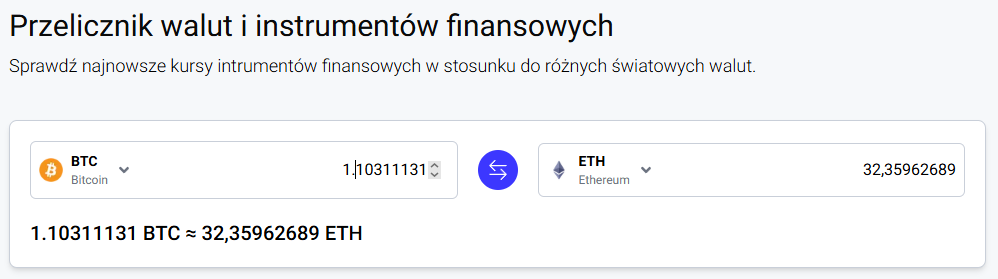

# Engineering Thesis

Asset Flow - a responsive web application designed for comprehensive personal finance management. The system enables users to control their budgets, monitor investments in cryptocurrencies and stocks, analyze financial data, and make informed decisions based on real-time market information.


## Table of contents

- Description
- Features
- Tech Stack
- Requirements
- Installation
- Launching
- Application Modules
- Screenshots of the App


## 📝 Description

Asset Flow is a modern, responsive web application created to support users in managing their personal finances in a clear and intuitive way. The application combines budget management with investment tracking, allowing users to monitor both everyday expenses and long-term financial assets in one place.

The project was developed as part of an engineering thesis and focuses on usability, scalability, and performance. It enables users to manage budgets, track cryptocurrency and stock investments, analyze financial indicators, and generate summaries that help evaluate their financial situation.

The system integrates financial data, investment tracking, and analytics into a single environment, eliminating the need for multiple separate tools. Thanks to an intuitive interface and real-time data presentation, the application supports both beginner and advanced users.


## 🚀 Features

- ✅ User registration and login
- ✅ Budget management
- ✅ Investment tracking
- ✅ Market data
- ✅ Analytics & reports
- ✅ Asset converter


## 🧱 Tech Stack

- Next.js
- TypeScript
- Redux Toolkit
- Tailwind CSS
- Recharts
- React Hook Form
 


## 📦 Requirements

- Node.js >= 18
- npm
- Backend API (running separately)


## 🛠 Installation

1. Clone the repository
   ```bash
   git clone https://github.com/MateuszPazdan/Engineering-Thesis.git

2. Go to folder
   ```bash
   cd Engineering-Thesis

3. Install dependencies
   ```bash
   npm install

## 🏃‍♂️ Launching

  ```bash
    npm run dev
  ```


## 🧩 Application Modules

- Authentication
- Budget module
- Investment module
- Market module
- Reports module
- Converter module


## 📸 Screenshots of the App

### 📊 Market Overview
General market statistics for cryptocurrencies and stocks.  



### 💰 Budget Management
Create and manage personal budgets and transactions. 



### 📈 Investments
Track cryptocurrency and stock portfolios.



### 📉 Analytics 
Visual summaries and performance charts.


### 🔄 Asset Converter
Compare and convert values between different financial instruments.



 


